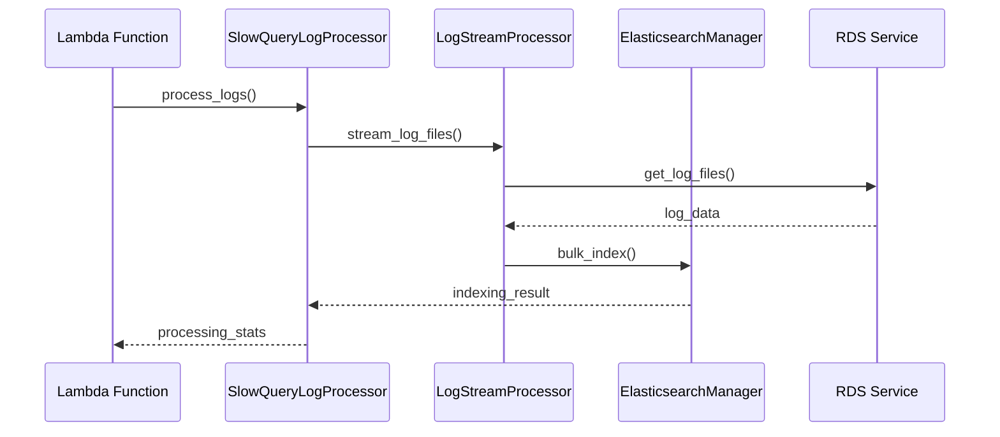

# RDS Slow Query Log Processor

RDS 슬로우 쿼리 로그를 효율적으로 처리하고 Elasticsearch에 인덱싱하는 AWS Lambda 기반 시스템입니다.

## 주요 기능

- RDS 슬로우 쿼리 로그 실시간 처리
- 메모리 효율적인 청크 단위 처리
- SQL 쿼리 정규화 및 분석
- Elasticsearch 벌크 인덱싱 최적화
- 자동 재시도 및 오류 복구
- 상세한 처리 통계 및 모니터링

## 시스템 아키텍처



## 프로젝트 구조

```
project_root/
├── src/
│   ├── config/
│   │   ├── config.py              # 기본 설정
│   │   └── processing_config.py   # 처리 관련 설정
│   ├── processors/
│   │   ├── batch_collector.py     # 배치 처리
│   │   ├── chunk_manager.py       # 청크 관리
│   │   ├── log_processor.py       # 로그 처리
│   │   ├── parallel_processor.py  # 병렬 처리
│   │   ├── query_normalizer.py    # 쿼리 정규화
│   │   └── slow_query.py         # 메인 프로세서
│   ├── elasticsearch/
│   │   └── manager.py            # ES 관리
│   └── utils/
│       ├── decorators.py         # 유틸리티 데코레이터
│       ├── logging.py           # 로깅 설정
│       ├── memory_tracker.py    # 메모리 추적
│       └── progress_tracker.py  # 진행상황 추적
├── tests/
│   └── __init__.py
├── debug_slow_query.py          # 디버그 스크립트
├── requirements.txt
└── README.md
```

## 설치 방법

1. Python 3.8 이상이 필요합니다.

2. 저장소 클론:
```bash
git clone [repository-url]
cd rds-slow-query-processor
```

3. 가상환경 생성 및 활성화:
```bash
python -m venv venv
source venv/bin/activate  # Windows: .\venv\Scripts\activate
```

4. 의존성 설치:
```bash
pip install -r requirements.txt
```

## 설정

1. AWS 자격 증명 설정:
```bash
aws configure
```

2. 환경 변수 설정:
```bash
export INSTANCE_ID=your-rds-instance-id
export ES_HOST=your-elasticsearch-host
export ES_INDEX_PREFIX=your-index-prefix
```

## 사용 방법

### Lambda 배포

1. 코드 패키징:
```bash
zip -r function.zip src requirements.txt
```

2. Lambda 함수 생성 및 배포:
```bash
aws lambda create-function \
  --function-name slow-query-processor \
  --runtime python3.8 \
  --handler src.lambda_function.lambda_handler \
  --zip-file fileb://function.zip \
  --role your-lambda-role-arn
```

### 로컬 테스트

디버그 스크립트를 사용하여 로컬에서 테스트:
```bash
python debug_slow_query.py
```

## 주요 컴포넌트

### QueryNormalizer
- SQL 쿼리 정규화
- 리터럴 값 파라미터화
- 쿼리 해시 생성

### ChunkManager
- 대용량 로그 파일 청크 분할
- 메모리 사용량 제어
- 청크 처리 상태 관리

### BatchCollector
- 처리된 문서 수집
- 벌크 인덱싱 최적화
- 배치 크기 동적 조절

### ElasticsearchManager
- ES 연결 관리
- 벌크 인덱싱
- 인덱스 템플릿 관리

## 모니터링

### 처리 통계
- 처리된 쿼리 수
- 인덱싱 성공/실패 수
- 평균 처리 시간
- 메모리 사용량

### 로깅
상세한 로그는 CloudWatch Logs에서 확인 가능:
- 처리 진행상황
- 에러 및 경고
- 성능 메트릭

## 성능 최적화

- 청크 크기 조절: `chunk_size` 설정
- 배치 크기 조절: `batch_size` 설정
- 병렬 처리 수준: `max_workers` 설정
- 메모리 임계치: `memory_threshold_mb` 설정

## 문제 해결

### 일반적인 문제

1. 메모리 부족
```python
# max_buffer_size_mb 설정 조절
config.max_buffer_size_mb = 512
```

2. 처리 속도 저하
```python
# batch_size 및 max_workers 조절
config.batch_size = 1000
config.max_workers = 4
```

3. ES 연결 실패
```python
# es_timeout 및 es_retry_count 조절
config.es_timeout = 30
config.es_retry_count = 3
```

## 기여 방법

1. Fork the repository
2. Create your feature branch (`git checkout -b feature/AmazingFeature`)
3. Commit your changes (`git commit -m 'Add some AmazingFeature'`)
4. Push to the branch (`git push origin feature/AmazingFeature`)
5. Open a Pull Request

## 라이선스

이 프로젝트는 MIT 라이선스로 제공됩니다. 자세한 내용은 [LICENSE](LICENSE) 파일을 참조하세요.

## 연락처

프로젝트 관리자 - sulum85@gmail.com

